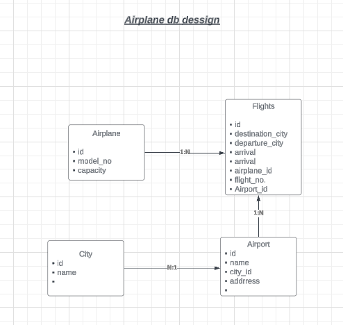

# AIRLINE BOOKING SYSTEM - Product Requirement Document

## Objective
We are going to build a backend system that will include features typically found in an airline booking system. Our end user will be someone looking to book a flight online and query available flights.

## Requirements

### Flight Search
- A user should be able to search for flights from one location to another.
- The user should be able to specify the source and destination.
- The user should be able to select the date and time.
- The user should be able to select the class of the flight (e.g., Economy, Business).
- The user should be able to select the number of seats.
- Flights should be sorted with the best available options on top (in terms of price and time).
- Support pagination for flight search results.
- Provide custom filters based on:
  - Price
  - Duration
  - Departure time
  - Airlines
  - Stops
- **[v2]**: Add support for return flights and multi-city flights.

### Flight Booking & Management
- A user should be able to book flights, given they are authenticated.
- The user should be able to cancel a flight booking.
- Dummy payment system for booking confirmation.
- Flight price tracking feature to notify users of any price changes.
- Users should be able to view their previous and upcoming bookings.
- Users should be able to download their boarding pass if they have completed online check-in.
- Support for online check-in.
- Notify users of online check-in availability 3 hours before departure.
- Notify users of any flight delays.
- Users should be able to submit reviews and rate the flight after booking (star rating system).
- While listing flights, user ratings should be considered.

### Authentication & Notifications
- Authentication should be done using email and password.
- Users should be able to raise queries through a ticketing system.
- Send notifications for online check-in and flight delays.

### Additional Features
- Excess luggage booking facility.
- Provide discount coupons and offers for bookings.
- Support multiple bookings under the same login ID.

## High-Level Diagram
- Available on Lucid.com

### Search and flights service

* create flights 
* delete flights
* update flights 
* search flights 
    * pagination 
    * different criteria 

 >  

### DB DESIGN 

  - Airplane table 
  - Flight 
  - Airports
  - City 
  

  > A Flight belongs to an airplane but any aeroplne can be used in many flights
  > A city has many airports
  > One airport can have many flights, but a flight belongs to a airport.
   
    